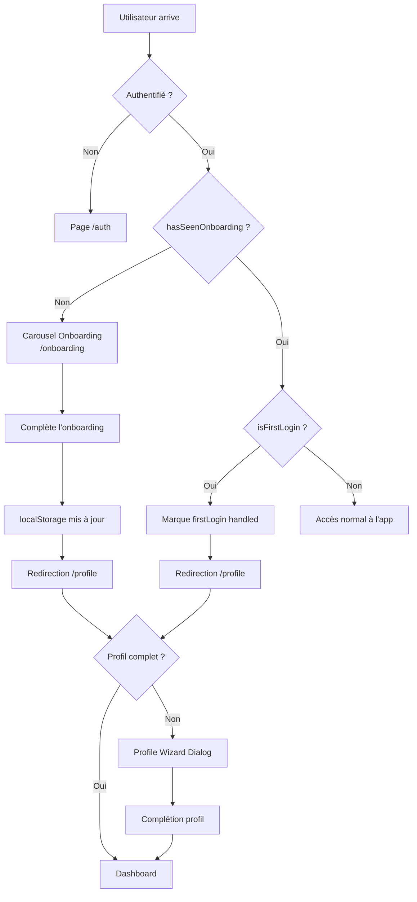

# 📋 Refonte du Système d'Onboarding - MyHealth+

> **Date d'analyse** : Janvier 2025  
> **Version** : 1.0  
> **Statut** : État des lieux complet

---

## 📚 Table des matières

| Document | Description |
|----------|-------------|
| [ETAT_ACTUEL.md](./ETAT_ACTUEL.md) | Analyse détaillée des 3 scénarios utilisateur |
| [AXES_AMELIORATION.md](./AXES_AMELIORATION.md) | Propositions de refonte et migration |
| [FICHIERS_CONCERNES.md](./FICHIERS_CONCERNES.md) | Liste exhaustive des fichiers à modifier |

---

## 🎯 Vue d'ensemble

Le système d'onboarding de MyHealth+ gère le parcours des nouveaux utilisateurs depuis leur inscription jusqu'à la complétion de leur profil. Il repose actuellement sur une architecture **localStorage-centric** avec plusieurs composants interconnectés.

### Composants principaux

```
┌─────────────────────────────────────────────────────────────────┐
│                     SYSTÈME D'ONBOARDING                        │
├─────────────────────────────────────────────────────────────────┤
│                                                                 │
│  ┌─────────────┐    ┌─────────────┐    ┌─────────────┐         │
│  │   Auth.tsx  │───▶│ProtectedRoute│───▶│ Onboarding  │         │
│  │ (Connexion) │    │  (Gardien)  │    │  (Carousel) │         │
│  └─────────────┘    └─────────────┘    └─────────────┘         │
│         │                  │                  │                 │
│         │                  ▼                  ▼                 │
│         │          ┌─────────────┐    ┌─────────────┐          │
│         │          │useOnboarding│    │ Profile.tsx │          │
│         │          │   (Hook)    │    │   + Wizard  │          │
│         │          └─────────────┘    └─────────────┘          │
│         │                  │                  │                 │
│         ▼                  ▼                  ▼                 │
│  ┌──────────────────────────────────────────────────────┐      │
│  │                   localStorage                        │      │
│  │  • hasSeenOnboarding_[userId]                        │      │
│  │  • isFirstLogin_[userId]                             │      │
│  │  • profileWizardShownOnce_[userId]                   │      │
│  └──────────────────────────────────────────────────────┘      │
│                                                                 │
└─────────────────────────────────────────────────────────────────┘
```

---

## 🔄 Flux d'onboarding



---

## ⚠️ Problèmes identifiés

| Priorité | Problème | Impact |
|----------|----------|--------|
| 🔴 Critique | État stocké uniquement en localStorage | Perte de l'état si changement de navigateur/appareil |
| 🟠 Élevé | Pas de distinction inscription/connexion | Impossible de savoir si "vrai" nouvel utilisateur |
| 🟡 Moyen | Logique `isFirstLogin` fragile | Peut causer des redirections incorrectes |
| 🟢 Faible | Délai de 100ms après complétion | Workaround pour synchronisation |

---

## 📊 Clés localStorage utilisées

| Clé | Format | Utilisé par | Description |
|-----|--------|-------------|-------------|
| `hasSeenOnboarding_[userId]` | `"true"` / absent | useOnboarding, ProtectedRoute | Carousel vu |
| `isFirstLogin_[userId]` | `"true"` / absent | useOnboarding, ProtectedRoute | Premier login géré |
| `profileWizardShownOnce_[userId]` | `"true"` / absent | useProfileWizard | Wizard profil montré |

---

## 📂 Structure du dossier

```
docs/refactor/onboarding/
├── README.md              ← Ce fichier
├── ETAT_ACTUEL.md         ← Analyse des 3 scénarios
├── AXES_AMELIORATION.md   ← Propositions de refonte
└── FICHIERS_CONCERNES.md  ← Fichiers à modifier
```

---

## 🚀 Prochaines étapes recommandées

1. **Lire** [ETAT_ACTUEL.md](./ETAT_ACTUEL.md) pour comprendre le comportement actuel
2. **Analyser** [AXES_AMELIORATION.md](./AXES_AMELIORATION.md) pour les solutions proposées
3. **Planifier** la migration avec [FICHIERS_CONCERNES.md](./FICHIERS_CONCERNES.md)
