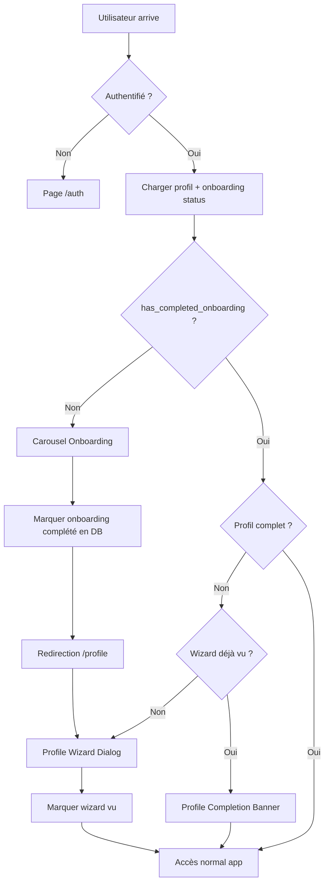

# 🚀 Axes d'Amélioration du Système d'Onboarding

> Propositions de refonte pour un système robuste et scalable

---

## 📋 Sommaire des Propositions

| # | Proposition | Effort | Impact | Priorité |
|---|-------------|--------|--------|----------|
| 1 | Persister l'onboarding en DB | Moyen | Élevé | 🔴 P1 |
| 2 | Simplifier les états localStorage | Faible | Moyen | 🟠 P2 |
| 3 | Nouveau flux unifié | Moyen | Élevé | 🟠 P2 |
| 4 | Intégration Driver.js | Élevé | Moyen | 🟢 P3 |

---

## 1️⃣ Proposition 1 : Persister l'Onboarding en Base de Données

### Objectif
Déplacer l'état d'onboarding de localStorage vers la table `profiles` Supabase.

### Migration SQL

```sql
-- Ajouter les colonnes d'onboarding à la table profiles
ALTER TABLE public.profiles 
ADD COLUMN IF NOT EXISTS has_completed_onboarding BOOLEAN DEFAULT FALSE,
ADD COLUMN IF NOT EXISTS onboarding_completed_at TIMESTAMP WITH TIME ZONE,
ADD COLUMN IF NOT EXISTS first_login_at TIMESTAMP WITH TIME ZONE;

-- Mettre à jour les profils existants (considérés comme ayant fait l'onboarding)
UPDATE public.profiles 
SET has_completed_onboarding = TRUE,
    onboarding_completed_at = created_at
WHERE created_at < NOW() - INTERVAL '1 day';

-- Index pour les requêtes fréquentes
CREATE INDEX IF NOT EXISTS idx_profiles_onboarding 
ON public.profiles(has_completed_onboarding);
```

### Nouveau Hook `useOnboarding.ts`

```typescript
import { useState, useCallback, useEffect } from 'react';
import { useAuth } from './useAuth';
import { supabase } from '@/integrations/supabase/client';

export const useOnboarding = () => {
  const { user } = useAuth();
  const [hasCompletedOnboarding, setHasCompletedOnboarding] = useState<boolean | null>(null);
  const [isLoading, setIsLoading] = useState(true);

  // Charger l'état depuis Supabase
  useEffect(() => {
    if (!user) {
      setIsLoading(false);
      return;
    }

    const fetchOnboardingStatus = async () => {
      const { data, error } = await supabase
        .from('profiles')
        .select('has_completed_onboarding')
        .eq('id', user.id)
        .single();

      if (!error && data) {
        setHasCompletedOnboarding(data.has_completed_onboarding ?? false);
      }
      setIsLoading(false);
    };

    fetchOnboardingStatus();
  }, [user]);

  // Marquer l'onboarding comme complété
  const completeOnboarding = useCallback(async (): Promise<boolean> => {
    if (!user) return false;

    const { error } = await supabase
      .from('profiles')
      .update({
        has_completed_onboarding: true,
        onboarding_completed_at: new Date().toISOString()
      })
      .eq('id', user.id);

    if (!error) {
      setHasCompletedOnboarding(true);
      return true;
    }
    return false;
  }, [user]);

  // Reset pour les tests/debug
  const resetOnboarding = useCallback(async (): Promise<boolean> => {
    if (!user) return false;

    const { error } = await supabase
      .from('profiles')
      .update({
        has_completed_onboarding: false,
        onboarding_completed_at: null
      })
      .eq('id', user.id);

    if (!error) {
      setHasCompletedOnboarding(false);
      return true;
    }
    return false;
  }, [user]);

  return {
    hasCompletedOnboarding,
    isLoading,
    completeOnboarding,
    resetOnboarding
  };
};
```

### Avantages
- ✅ État synchronisé sur tous les appareils
- ✅ Pas de perte lors du vidage cache
- ✅ Analytics possibles côté serveur
- ✅ Cohérence avec le reste du profil

### Inconvénients
- ⚠️ Requête DB supplémentaire au chargement
- ⚠️ Migration nécessaire pour les utilisateurs existants

---

## 2️⃣ Proposition 2 : Simplifier les États localStorage

### Objectif
Si la migration DB n'est pas immédiate, simplifier la logique localStorage actuelle.

### État Actuel vs Proposé

| Clé Actuelle | Action | Clé Proposée |
|--------------|--------|--------------|
| `hasSeenOnboarding_[userId]` | Conserver | `onboarding_[userId]` |
| `isFirstLogin_[userId]` | Supprimer | ❌ |
| `profileWizardShownOnce_[userId]` | Fusionner | `onboarding_[userId].wizard` |

### Nouveau Format

```typescript
// Avant : 3 clés séparées
localStorage.setItem('hasSeenOnboarding_abc123', 'true');
localStorage.setItem('isFirstLogin_abc123', 'true');
localStorage.setItem('profileWizardShownOnce_abc123', 'true');

// Après : 1 clé structurée
localStorage.setItem('onboarding_abc123', JSON.stringify({
  completedAt: '2025-01-14T10:00:00Z',
  wizardShownAt: '2025-01-14T10:05:00Z',
  version: 1 // Pour migrations futures
}));
```

### Hook Simplifié

```typescript
interface OnboardingState {
  completedAt: string | null;
  wizardShownAt: string | null;
  version: number;
}

const getOnboardingState = (userId: string): OnboardingState => {
  const key = `onboarding_${userId}`;
  const stored = localStorage.getItem(key);
  
  if (stored) {
    try {
      return JSON.parse(stored);
    } catch {
      // Migration depuis ancien format
      const oldKey = `hasSeenOnboarding_${userId}`;
      if (localStorage.getItem(oldKey) === 'true') {
        return { completedAt: new Date().toISOString(), wizardShownAt: null, version: 1 };
      }
    }
  }
  
  return { completedAt: null, wizardShownAt: null, version: 1 };
};
```

---

## 3️⃣ Proposition 3 : Nouveau Flux Unifié

### Diagramme du Nouveau Flux



### Simplification de ProtectedRoute

```typescript
// Nouveau ProtectedRoute simplifié
const ProtectedRoute: FC<Props> = ({ children }) => {
  const { user, isLoading: authLoading } = useAuth();
  const { hasCompletedOnboarding, isLoading: onboardingLoading } = useOnboarding();
  const location = useLocation();

  // Attendre le chargement
  if (authLoading || onboardingLoading) {
    return <LoadingScreen />;
  }

  // Non authentifié → Auth
  if (!user) {
    return <Navigate to="/auth" replace />;
  }

  // Onboarding non complété → Onboarding (sauf si déjà dessus)
  if (!hasCompletedOnboarding && location.pathname !== '/onboarding') {
    return <Navigate to="/onboarding" replace />;
  }

  // Sinon → Accès normal
  return <>{children}</>;
};
```

### Avantages
- ✅ Logique de redirection simplifiée (2 conditions au lieu de 4)
- ✅ Plus de `isFirstLogin` ambigu
- ✅ Séparation claire onboarding / profil wizard
- ✅ Code plus maintenable

---

## 4️⃣ Proposition 4 : Intégration Driver.js (Tutoriel Interactif)

### Objectif
Remplacer ou compléter le carousel statique par un tutoriel interactif guidé.

### Architecture Proposée

```
┌─────────────────────────────────────────────────────────────────┐
│                    TUTORIEL INTERACTIF                          │
├─────────────────────────────────────────────────────────────────┤
│                                                                 │
│  Phase 1: Carousel (actuel)                                     │
│  └─▶ Présentation générale de l'app                            │
│                                                                 │
│  Phase 2: Driver.js Tour (nouveau)                              │
│  └─▶ Tour guidé sur la vraie interface                         │
│      • Highlight du bouton "Nouveau traitement"                 │
│      • Explication du calendrier                                │
│      • Présentation du profil                                   │
│                                                                 │
│  Phase 3: Première Action Guidée                                │
│  └─▶ Accompagner la création du 1er traitement                 │
│                                                                 │
└─────────────────────────────────────────────────────────────────┘
```

### Implémentation Driver.js

```typescript
// src/hooks/useInteractiveTutorial.ts
import { driver } from 'driver.js';
import 'driver.js/dist/driver.css';

export const useInteractiveTutorial = () => {
  const startTour = () => {
    const driverObj = driver({
      showProgress: true,
      steps: [
        {
          element: '#add-treatment-button',
          popover: {
            title: 'Ajouter un traitement',
            description: 'Commencez par ajouter votre premier traitement ici',
            side: 'bottom'
          }
        },
        {
          element: '#calendar-view',
          popover: {
            title: 'Votre calendrier',
            description: 'Visualisez toutes vos prises de médicaments',
            side: 'top'
          }
        },
        {
          element: '#profile-avatar',
          popover: {
            title: 'Votre profil',
            description: 'Complétez votre profil pour une meilleure expérience',
            side: 'left'
          }
        }
      ]
    });

    driverObj.drive();
  };

  return { startTour };
};
```

### Référence
Voir `docs/DIDACTICIEL_INTERACTIF.md` pour les spécifications complètes.

---

## 📊 Comparaison des Approches

| Critère | Actuel | Prop. 1 (DB) | Prop. 2 (localStorage) | Prop. 3 (Unifié) |
|---------|--------|--------------|------------------------|------------------|
| Multi-appareils | ❌ | ✅ | ❌ | ✅ |
| Simplicité code | ⭐⭐ | ⭐⭐⭐ | ⭐⭐⭐⭐ | ⭐⭐⭐⭐ |
| Effort migration | N/A | Moyen | Faible | Moyen |
| Analytics | ❌ | ✅ | ❌ | ✅ |
| Offline support | ✅ | ⚠️ | ✅ | ⚠️ |

---

## 🎯 Recommandation Finale

### Court terme (immédiat)
1. Simplifier les clés localStorage (Prop. 2)
2. Refactorer ProtectedRoute (Prop. 3 partielle)

### Moyen terme (1-2 sprints)
1. Migrer vers Supabase (Prop. 1)
2. Supprimer la dépendance localStorage pour l'onboarding

### Long terme (roadmap)
1. Intégrer Driver.js (Prop. 4)
2. A/B testing des parcours d'onboarding
3. Analytics sur les abandons d'onboarding
